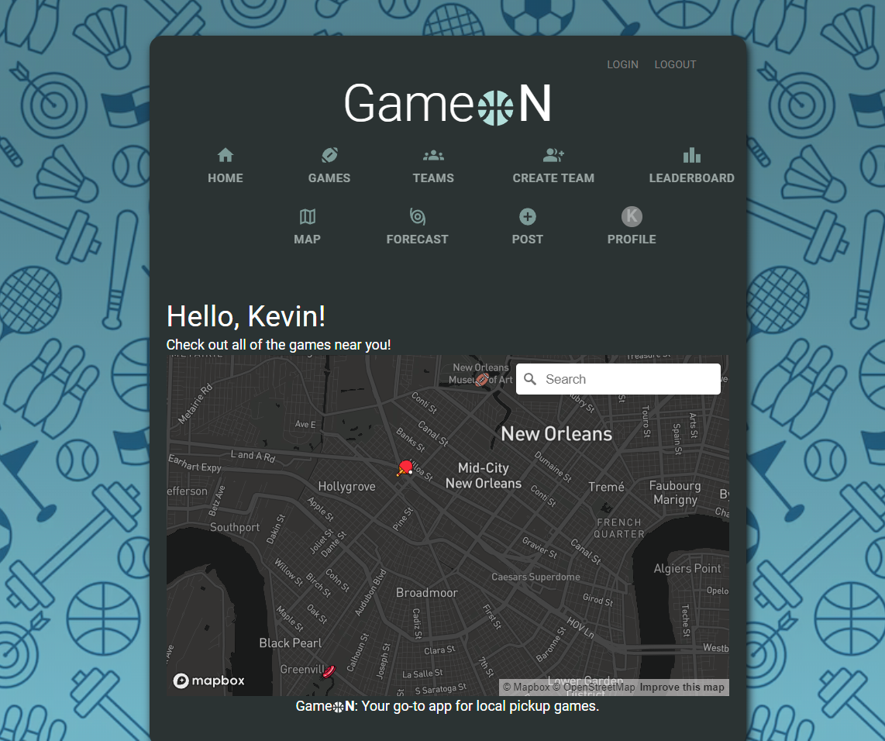
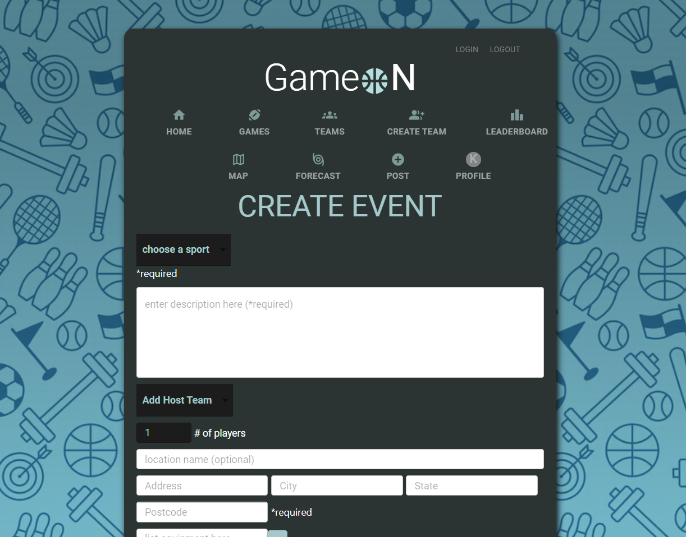

 <h1 align='left'>GameON</h2>

 <h2 align='left'>DESCRIPTION</h2>

---

  GameON is a sports meetup application that allows you to view sporting events happening in your area. You can create events by picking from our selection of sports, setting a data, time, and location. After an event is created, you can navigate over to the sports tab to view all of the events, and either RSVP to specific events that you might be interested in or simply view the ones you created. Once you have events that you are commited to, you can then view them on the map to see the different events' locations. You also have a profile, via Google account, that will list all of your hosted events, as well as events that you're attending. Whether you wanna BLAST a baseball into space, or SLAM DUNK on the haters in your area, this app will make it easier than ever to organize.

---

 <h2 align='left'>OVERVIEW</h2>

 - HOME
 - GAMES
 - MAP
 - POST
 - PROFILE

---

 <h2 align='left'>HOW TO START THE APP</h2>

- in your terminal, run npm install or npm -i to install all of your dependencies

- `<npm run build>` to compile your files with webpack

- in a separate terminal, run  `<npm run start>` to start up your server

- create a .env file. the template can be copied from the example.env file
---
 <h2 align='left'>SETUP YOUR ENVIRONMENT</h2>

The current project is configured for use with MongoDB Cloud. You will need to update the DB server files (DB URI) for your specific configuration.

In your .env file, add the following environment variables:
  - MONGODB_PASS= if using MongoDB Cloud, use your connection password here
  - USERNAME= if using MongoDB Cloud, use your connection username here
  - MAP_TOKEN= create a MAPBOX account and create an access token
  - CLIENT_ID= see Google OAuth instructions
  - CLIENT_SECRET= see Google OAuth instructions
  - EXPRESS_SECRET= designate your own unique value
  - DB_URI= your MongoDB connection string

---
<h2 align='left'>GOOGLE OAUTH</h2>

- Go to google api console website

- click create and name the project

- go to the project and name your app

- create the OAuth client ID and secret in credentials section of your project

- in Application, choose type: web application. fill in the Authorized JavaScript origins as follows:
  in authorized javascript origins: http://localhost:3000
  in authorized redirect URIs: http://localhost:3000/auth/google/callback

- when you receive client ID and client secret, place these values in your .env file

---
<h2 align='left'>DEPLOYMENT WITH AMAZON WEB SERVICES </h2>

  - Create an AWS root user account @ https://aws.amazon.com/
  - As a root user, create a User Group for your project
    - Attach the Administrator Access permission policy to the group
    - Create new users for the group and enable a credentials type: Access Key/ Password
    - After successful creation of users, use the send email button to send all users within the group an email with an autogenerated email to sign-in. Provide the password or key to the individual users separately
    - Setup MFA (Multi Factor Authentication) for your account for increased security.

  - As an IAMUser, we'll want to launch an instance of our application
    - Search for EC2 in the search bar
    - Once on the page for EC2, click the Launch Instance button
    - Configure your setup
      - Select your Application and OS Images. For us, we used Ubuntu: 20.04
      - Create Key pair for secure connection to your deployed server. We recommend using PuTTYgen to create a key for your SSH
      - Configure the other settings as necessary and then click the 'Launch Instance

  - Accessing your Deployed Server
    - Once launched you will be given a Public IPv4 address
    - You can open up PuTTY, and load your newly acquired IP address and your private key and start up your connection to your server!
    - Once started, you'll want to install git, node and nvm to pull this repository onto the deployed instance.
    - We recommend using PM2 to keep the instance running even when you aren't connected via your local machine.
      - The command is : pm2 start server/index.js

- <h3>And there you have it, your server is live and persists!</h5>

---
 <h2 align='left'>INSTRUCTIONS FOR EVENTS LIST (SPORTS DISPLAY) PAGE/COMPONENTS</h2>

  - There must be at least some seeded data for the page to render the event cards in the browser.
  - There is no way currently to remove an entire event card from the 'current state' of the page, so keep that in mind while navigating.
  - The 'going/not going' toggle should be toggled according to the current attendees array in the database whether the user joined from a different page/component or not.
  - Context will be referenced to make use of the current states that are available at runtime.
  - Both the SportsSelect.jsx component and the Event.jsx component are being rendered on the EventListings.jsx component repesctively.
  - The EventListings component has functinoality to map through the data being pulled from the database to render each Event.jsx component based off of what is currently being returned from the request handlers in /server/index.js

---
 <h2 align='left'>KNOWN BUGS</h2>

---
The following are the various bugs we were unable to resolve during the course of our project:

<h4 align='left'>PROFILE / LOGIN / LOGOUT COMPONENT</h4>

  - User's events disappears upon page refresh.
  - Allows users to continuously log in and log out even after logged in or logged out. It still shows sign in with Google even though the user is already logged in.

<h4 align='left'>MAP COMPONENT</h4>

  - For events at the same location, map overlaps icon markers and prevents popup of the underlying event.
  - onClick functions do not work within the popup button HTML
  - After a user updates their RSVP and the URL changes with their parameters, refreshing that page breaks that component. For
  example: localhost:3000/#/map?user=user@gmail.com&userId=62dadc628024c191c8328edd&event=62dadc272bb727037ff7ba04&status=Going

<h4 align='left'>EVENT COMPONENT</h4>

  - Toggle switch triggers multiple times upon click, but only aesthetically, it still only adds or removes once from the database, as inteded.
  - No ability to delete an event if you no longer want to see it on the page.
  - Dropdown bar dynamically resizes by the lenght of the new category selected, instead of staying a consistent amount of pixelation like other static buttons throughout the program.

  - Dropdown does not automatically close upon interaction
  - Toggle switch triggers multiple times upon click

  <h4 align='left'>CREATE EVENT COMPONENT</h4>

  - currently the equipment list doesn't serve any functionality. it is not storing anything in the database.

  - The Calendar date selection wont let you click on a date thats before the current date. but a user can still enter it manually.

  - User will get an error in the dev console if they try to backspace all of the input from the player limit. this was initially done to prevent them from entering a number less than 1.

  - Sometimes addresses entered from google chromes saved addresses will populate the full address inside of the first address field

---
  <h2 align='left'>Available Resources</h2>

  - https://www.mongodb.com/docs/cloud-manager/tutorial/connect-to-mongodb/
  - https://docs.mapbox.com/help/getting-started/access-tokens/
  - https://www.mongodb.com/docs/manual/reference/connection-string/
  - https://reactjs.org/docs/hooks-reference.html#useref
  - https://docs.mapbox.com/mapbox-gl-js/guides/
  - https://visgl.github.io/react-map-gl/docs/api-reference/popup
  - https://mui.com/material-ui/material-icons/
  - https://mui.com/material-ui/customization/color/#main-content
  - https://www.chiark.greenend.org.uk/~sgtatham/putty/latest.html
---
<h2 align='left'>Contact Us</h2>

<strong>Organization</strong>: Team Work4ce  
<strong>Product Owner</strong>: Bethany Jones 
<strong>Scrum Master</strong>: Caity Opelka  
<strong>Development Team</strong>: Vincent Tong, Bethany Jones, Ryan Smith, Royce Taylor  
<strong>Contact:</strong> betpetjones@gmail.com

---
## App Mockups

